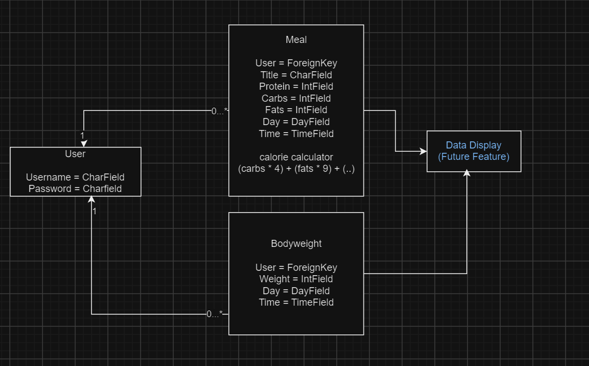

# Munchy - The Meal Tracking App

.png)

### Link to the deployed project:
## [Munchy Deployed Link](https://my-frenly-pt-eb54dfd3fc9e.herokuapp.com/)

---

## Purpose of Munchy

This Meal Tracking App helps users maintain a record of their meals and nutritional information. By clicking 'Add Meal' and filling out the form, users can log their meals with details about protein, carbs, fats, and meal time. Users can view, edit, and delete their meal entries while also monitoring total calorie intake for better health management. It also allows users to maintain a record of their weight by adding a weight entry to the weight table.

---

## Table of Contents

1. [User Demographics](#user-demographics)
2. [User Experience](#user-experience)
3. [Agile Methodology](#agile-methodology)
4. [Epics and User Stories](#epics-and-user-stories)
   - [User Authentication and Authorization](#user-authentication-and-authorization)
   - [Meal Management and Validation](#meal-management-and-validation)
   - [Weight Management and Validation](#weight-management-and-validation)
   - [User Interface, Experience, and Feedback](#user-interface-experience-and-feedback)
   - [User Flow](#user-flow)
5. [Features](#features)
7. [Future Features](#future-features)
8. [Bugs](#bugs)
9. [Design](#design)
   - [Color](#color)
   - [Wireframes](#wireframes)
   - [Entity Relationship Diagram](#entity-relationship-diagram)
   - [User Interface](#user-interface)
10. [Technology](#technology)
   - [Languages](#languages)
   - [Django Packages](#django-packages)
   - [Frameworks, Libraries, and Programs Used](#frameworks-libraries-and-programs-used)
11. [Testing](#testing)
12. [Project Creation](#project-creation)
    - [Creating the Django App](#creating-the-django-app)
    - [Deployment of This Project](#deployment-of-this-project)
    - [Final Deployment](#final-deployment)
13. [Forking This Project](#forking-this-project)
14. [Cloning This Project](#cloning-this-project)
15. [Installing This Project](#installing-this-project)
16. [Credits](#credits)

---

## User Demographics

This app is designed for anyone interested in managing their diet effectively. From fitness enthusiasts tracking macros to health-conscious individuals monitoring calorie intake, this app offers a comprehensive solution for meal tracking and weight management.

---

## User Experience

As a user, I want to be able to:

- Securely log in to my account using authentication credentials.
- Add meals with details about protein, carbs, and fats.
- View a list of meals with nutritional breakdowns and total calories.
- Edit or update my meal details.
- Delete meals when necessary.
- Add weight in either kilograms or pounds.
- View a list of weight entries with their value in kilograms or pounds.
- Edit or update my weight details.
- Delete weight entries when necessary.
- Ensure that my data remains private and secure.

---

## Agile Methodology

The project followed an Agile methodology, with tasks broken into Epics and User Stories to ensure user-focused development. User Stories were tracked on a Kanban board for efficient task management. The Kanban board provided structure and made the tasks more manageable. You can check out the User Stories on the kanban board linked [here](<https://github.com/users/chipsandbeans/projects/4>).

---

## Epics and User Stories
I came up with the epics and user stories prior to starting the project during my planning phase. I made some adjustments to the epics as the app evolved during the building process.

---

### User Authentication and Authorization
I have implemented a robost and secure sign up and log in mechanisms to ensure that users can safely and securely access the site. These epics provide users with secure access to their accounts while preventing unauthorised users from accessing their accounts and data. 

- [User Story #1 Account Registration](<https://github.com/chipsandbeans/Django-Final-Project/issues/1#issue-2694980261>)
- [User Story #2 User Log In](<https://github.com/chipsandbeans/Django-Final-Project/issues/2#issue-2731715138>)

### Meal Management and Validation
Effective management of your macronutrient and caloric intake is vital in managing your diet, health, weight and wellbeing. This epic focuses on providing users with the adequate tools to effectively log and track the nutritional value of their meals. It provides users the ability to create read update and delete meals whilest receiving messages notifying them after they have made, edited or deleted a meal. To ensure users don't accidentally delete a meal, users are asked are they sure they want to delete it.

- [User Story #3 Create A Meal](<https://github.com/chipsandbeans/Django-Final-Project/issues/3#issue-2731718922>)
- [User Story #6 View Meal](<https://github.com/chipsandbeans/Django-Final-Project/issues/6#issue-2731725699>)
- [User Story #4 Update Meal](<https://github.com/chipsandbeans/Django-Final-Project/issues/4#issue-2731720588>)
- [User Story #5 Delete Meal](<https://github.com/chipsandbeans/Django-Final-Project/issues/5#issue-2731723773>)
- [User Story #12 Messages](<https://github.com/chipsandbeans/Django-Final-Project/issues/12#issue-2733178124>)
- [User Story #13 Confirm Delete Meal](<https://github.com/chipsandbeans/Django-Final-Project/issues/13#issue-2734522486>)

### Weight Management and Validation
One way we can see how our dietary intake is effecting our health and wellbeing is by tracking our weight over time to see how the food we ingest is effecting our bodies. This epic focuses on providing users the ability to log and track their weight over time in either kilograms or pounds. It focuses on giving users the ability to create update and delete weight entries and displaying the weight entries on a table where it is clearly visible. It also focuses on providing the user with messages confirming what they have done.

- [User Story #8 Add a weight](<https://github.com/chipsandbeans/Django-Final-Project/issues/8>)
- [User Story #9 Update Weight](<https://github.com/chipsandbeans/Django-Final-Project/issues/9>)
- [User Story #11 View Weight](<https://github.com/chipsandbeans/Django-Final-Project/issues/11>)
- [User Story #10 Delete Weight Entry](<https://github.com/chipsandbeans/Django-Final-Project/issues/10>)
- [User Story #12 Messages](<https://github.com/chipsandbeans/Django-Final-Project/issues/12#issue-2733178124>)
- [User Story #13 Confirm Weight Deletion](<https://github.com/chipsandbeans/Django-Final-Project/issues/14>)

### User Interface, Experience and Feedback
This epic prioritises making the site easily navigable with a clean UI. It emphasises being dynamic and adaptable to all screen sizes and optimising the UI. It also focuses on making sure all interactive elements are clearly displayed and easily visible with the goal of making the site as accessible as possible.

- [User Story #7 Easy to use UI](<https://github.com/chipsandbeans/Django-Final-Project/issues/7>)

### User Flow

1. **Sign Up / Log In**: Users can create an account or log in to access their meal and weight tracking dashboard.
2. **Meal Management**: Users can add, update, or delete their meals.
3. **Weight Tracking**: Users can log their weight and see a history of their logged weights.
4. **Notifications**: Users receive feedback messages on successful actions like adding meals, deleting weights, etc.
5. **Responsive Design**: The app works well on both mobile and desktop devices, with meal cards and weight entries adapting to screen sizes.

---

## Features

1. **Meal Tracking**:
   - Users can log their meals, including details about protein, carbs, and fats.
   - Users can update or delete meals they've created.
   - Users can view any meals they've created.
  
     # Add Meal
     
  
     # Update Meal
     

     # Delete Meal
     

     # Meal Details
     
     

2. **Weight Tracking**:
   - Users can log their weight entries and track progress over time.
   - Users can view, update or delete weight entries.
  
     # Add Weight
     

     # Update Weight
     

     # Delete Weight
     

     # View Weight
     

3. **User Authentication**:
   - Sign-up and login functionality for secure access to meal and weight tracking.
   - Users are redirected if they try to access restricted pages while not logged in.

     # Log In
     

     # Sign Up
     

4. **Dynamic and Adaptable Interface**:
   - The website adapts to all screen sizes, ensuring a smooth experience across devices.
   - Background images adjust for different screen sizes.
  
     


5. **User Feedback with Messages**:
   - Users receive messages confirming actions like meal updates, weight tracking entries, or logouts.

    
    

---

## Future Features

1. Integration with external APIs for nutritional data.
2. Data dashboard with advanced analytics for tracking macros, calories and weight over time.
3. Social sharing features for meals and progress.

---

## Bugs

- If using certain extensions in chrome, users may get an error on the meal list page. I don't know what is causing this as something external is causing it however this error does go away if you switch to incognito mode.

## Design

### Color

The app features a blue and white color scheme for a calm and professional look.


### Wireframes

Wireframes were designed to visualize user flows and interface layouts. These were created prior to the implementation of the project and some of the layout has since changed and evolved but much of the design is still the same.


### Entity Relationship Diagram

The database supports efficient storage and retrieval of user and meal data.


### User Interface

The UI prioritizes accessibility and responsiveness for a seamless user experience across all different devices.

---

# Technology

---

### Languages

- HTML5
- CSS3
- JavaScript
- Python
- Django

### Django Packages

1. **Gunicorn**: WSGI server for deployment.
2. **Dj_database_url**: Database URL parsing.
3. **Psycopg2**: PostgreSQL adapter for Python.
4. **Allauth**: Authentication and account management.
5. **Crispy Forms**: Enhanced form styling.

### Frameworks, Libraries, and Programs Used

- **Django**: Python web framework used for backend development.
- **PostgreSQL**: Database used for storing user data, meals, and weight entries.
- **Bootstrap**: Front-end framework for responsive design.
- **JavaScript**: Used for dynamic and interactive components.
- **CSS**: Used for styling.
- **GIT**: Used git for version control using the gitpod terminal.
- **Heroku**: Used to deploy the live project.
- **Github**: The Project's code was stored in github.
- **PEP8**: Python code was validated using PEP8.
- **W3C HTML**: Validated HTML code using W3C'S HTML validator.
- **W3C HTML**: Validated CSS code using W3C'S CSS validator.
- **Chrome Devtools**: Used devtools on google chrome to test website responsiveness and to check for bugs.
- **Balsamiq**: For Wireframe design
- **Canva**: For custom image design.

---

## Testing

The app underwent extensive manual and automated testing to ensure reliability, usability, and accessibility. Check out my testing document [here](<https://github.com/chipsandbeans/Django-Final-Project/blob/7ec0546c54c9d73259dfa43fed14ab0b319e16f0/TESTS.md>)

---

## Project Creation

### Creating the Django App

1. Go to the Code Institute Gitpod Full Template [Template](https://github.com/Code-Institute-Org/gitpod-full-template).
2. Click "Use This Template".
3. As soon as the template is available in your repository, click on Gitpod.
4. When Gitpod and the image for the template are ready, open a new terminal to start a new Django App.
5. Install Django and gunicorn: `pip3 install django gunicorn`.
6. Install supporting database libraries: dj_database_url and psycopg2 library: `pip3 install dj_database_url psycopg2`.
7. Create a file for requirements: in the terminal type `pip freeze --local > requirements.txt`.
8. Create your project: in the terminal window, type "django-admin startproject your_project_name".
9. Create your app: in the terminal type "python3 manage.py startapp "app_name".
10. Add your app to the list of installed apps in settings.py file: "app_name".
11. Migrate the changes: in the terminal type "python3 manage.py migrate".
12. Run the server to see if the app is installed. In the terminal window type: "python3 manage.py runserver".
13. If the app was installed correctly the window will show a message saying "The install worked successfully! Congratulations!".

### Deployment of This Project

1. Log in to [Heroku](https://id.heroku.com). If you don't have an account, create an account.
2. On the main page click the "New" button in the top right corner. From the drop-down menu, select "Create New App".
3. You must enter a unique app name.
4. Select your region.
5. Click the "Create App" button.
6. Click in resources and select "Heroku Postgres database".
7. Click Reveal Config Vars.
8. Add a new record with SECRET_KEY.
9. Click Reveal Config Vars.
10. Add a new record with the `CLOUDINARY_URL`.
11. Click Reveal Config Vars.
12. Add a new record with the `DISABLE_COLLECTSTATIC = 1`.
13. The next page is the project’s Deploy Tab. Click on the Settings Tab and scroll down to Config Vars.
14. Scroll down to the "Buildpack" section.
15. Click "Add Buildpack", select python and click "Save Changes".
16. Go to the top of the page and choose the Deploy tab.
17. Select Github as the deployment method.
18. Confirm you want to connect to GitHub.
19. Search for the repository name and click the "connect" button.
20. Scroll to the bottom of the deploy page and select the preferred deployment type.
21. Click either Enable Automatic Deploys for automatic deployment when you push updates to Github or click Manual Deploys if you want to do it manually.

### Final Deployment

1. Create a runtime.txt `python`
2. Create a Procfile `web: gunicorn project_name.wsgi`
3. When development is complete change the debug setting to false: `DEBUG = False` in your settings.py file.
4. If you use the summernote editor add this to settings.py for it to work on Heroku: `X_FRAME_OPTIONS = SAMEORIGIN `.
5. In Heroku settings, delete the config vars for `DISABLE_COLLECTSTATIC = 1`
---

## Forking This Project

1. Navigate to the GitHub repository.
2. Click the "Fork" button in the top-right corner.
3. The project will be forked into your account.

---

## Cloning This Project

Open up [GitHub]([https://github.com/Tekali7/Costly](https://github.com/chipsandbeans/Django-Final-Project))
1. Copy the repository URL from GitHub.
2. Use `git clone <URL>` in your terminal.
3. Navigate to the cloned directory and set up the project locally.

---

## Installing this project

To run the Munchy app locally:

1. Clone the repository:
   ```bash
   git clone https://github.com/yourusername/munchy.git
   cd munchy
   ```

2. Install dependencies:
   ```bash
   pip install -r requirements.txt
   ```

3. Set up the database:
   ```bash
   python manage.py migrate
   ```

4. Create a superuser (for admin access):
   ```bash
   python manage.py createsuperuser
   ```

5. Run the server:
   ```bash
   python manage.py runserver
   ```

6. Navigate to `http://localhost:8000` to access the app.

---

## Credits

- **Django Documentation**: For framework insights and best practices.
- **Bootstrap Documentation**: For responsive design guidance.
- **Mentor Guidance**: For UI feedback and guidance when I am stuck on certain errors or bugs..
- **StackOverflow**: For troubleshooting and debugging tips.
- **ChatGPT**: For troubleshooting and debugging tips.
- **Slack**: For troubleshooting and researching.
- **YouTube**: For research and learning.
