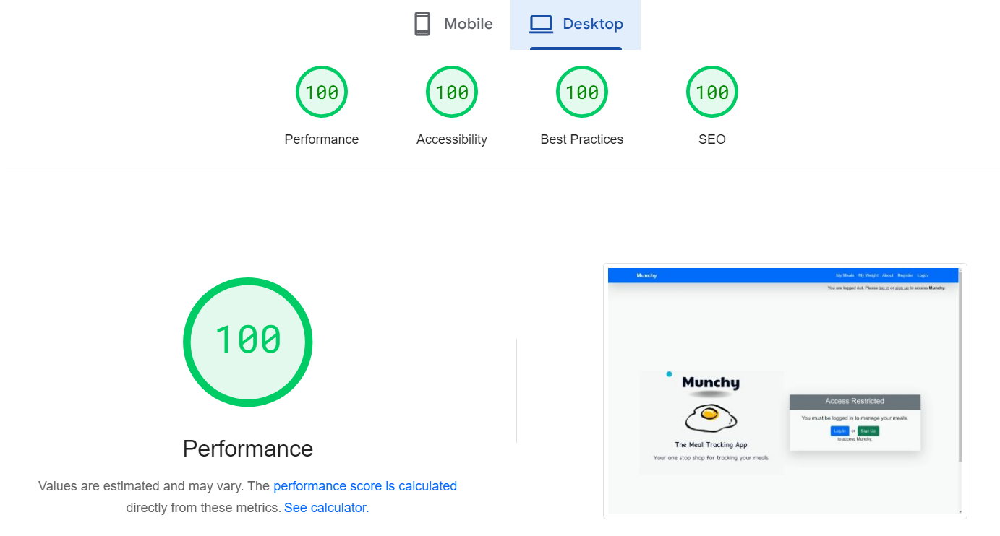

# Munchy Tests

Return to the README.md file [here](<your_repo_link_here>).

---

# Table of Contents

- [Validation](#validation)  
  - [HTML Validation](#html-validation)  
  - [CSS Validation](#css-validation)  
  - [JavaScript Validation](#javascript-validation)  
  - [Python Validation](#python-validation)  
- [Manual Testing](#manual-testing)  
  - [Test Navigation when Logged In](#test-navigation-when-logged-in)  
  - [Test Navigation when Not Logged In](#test-navigation-when-not-logged-in)  
  - [Test Meal Actions](#test-meal-actions)  
  - [Test Admin Panel](#test-admin-panel)  
- [Lighthouse Testing](#lighthouse-testing)  

---

# Validation

## HTML Validation

The [W3C Validator](https://validator.w3.org/) was used to validate HTML files. Django-specific syntax (e.g., curly braces) sometimes produced errors but did not affect functionality.

| **File**            | **Result** |
|----------------------|------------|
| base.html           |    |
| custom_login_message.html   |&#10004;    |
| custom_weight_login_message.html   |&#10004;    |
| meal_list.html          |&#10004;   |
| meal_form.html     |&#10004;    |
| update_meal.html      |&#10004;    |
| meal_confirm_delete.html |&#10004;     |
| meal_detail.html      |&#10004;    |
| weight_list.html  |&#10004;    |
| add_weight.html        |&#10004;   |
| update_weight.html        |&#10004;   |
| delete_weight.html   |&#10004;    |
| 403.html          |&#10004;   |
| about_us.html          |&#10004;   |
| login.html       |&#10004;    |
| logout.html      |    |
| signup.html      |    |

---

## CSS Validation

The [Jigsaw W3C Validator](https://jigsaw.w3.org/css-validator/) was used to validate the custom CSS.

| **File**     | **Result** |
|--------------|------------|
| styles.css   | &#10004;   |

No validation issues were encountered.

---

## JavaScript Validation

The [JSHint](https://jshint.com/) tool was used for JavaScript validation.

| **File**       | **Result** |
|-----------------|------------|
| scripts.js     | &#10004;   |

Warnings for ES6 features and undefined variables due to libraries (e.g., Bootstrap) were ignored as they do not affect functionality.

---

## Python Validation

The [CI Python Linter](https://pep8ci.herokuapp.com/) was used to validate Python code. Lines over 80 characters were broken up to comply with PEP8.

| **App**      | **File**         | **Result** |
|--------------|------------------|------------|
| crm          | settings.py      | &#10004;   |
| crm          | urls.py          | &#10004;   |
| crm          | views.py         | &#10004;   |
| crm        | admin.py         |  &#10004;  |
| crm        | forms.py         | &#10004;   |
| crm        | models.py        |&#10004;   |
| crm        | urls.py          | &#10004;   |
| crm        | views.py         | &#10004;   |
| myproject          | settings.py      | &#10004;   |
| myproject           | urls.py          | &#10004;   |
| myproject          | wsgi.py         | &#10004;   |
| myproject        | admin.py         |  &#10004;  |
| myproject         | forms.py         | &#10004;   |
| myproject        | models.py        |&#10004;   |
| myproject        | urls.py          | &#10004;   |
| myproject         | views.py         | &#10004;   |
| about_us          | apps.py         | &#10004;   |
| about_us        | admin.py         |  &#10004;  |
| about_us         | tests.py         | &#10004;   |
| about_us        | models.py        |&#10004;   |
| about_us        | urls.py          | &#10004;   |
| about_us         | views.py         | &#10004;   |

---

# Manual Testing

## Test Navigation when Logged In

| **Test**                          | **Expected Outcome**                            | **Result** |
|-----------------------------------|------------------------------------------------|------------|
| Navigate to the home page         | Displays the user's meal list and dashboard.  | &#10004;   |
| Click the "Logout" button         | User is logged out and redirected to the custom login page. | &#10004;   |

---

## Test Navigation when Not Logged In

| **Test**                                | **Expected Outcome**                           | **Result** |
|-----------------------------------------|-----------------------------------------------|------------|
| Attempt to access meal detail pages           | Redirected to error 403 page.                | &#10004;   |
| Access "Login" and "Sign Up" links      | Redirects to the appropriate authentication forms. | &#10004;   |

---

## Test Meal Actions

### Add Meal

| **Test**                                 | **Expected Outcome**                           | **Result** |
|------------------------------------------|-----------------------------------------------|------------|
| Open the "Add Meal" form                 | The form is displayed with all fields visible. | &#10004;   |
| Submit valid meal data                   | Meal is added to the database and listed on the dashboard. | &#10004;   |
| Submit invalid meal data                 | Displays validation errors.                  | &#10004;   |

---

### Edit Meal

| **Test**                                 | **Expected Outcome**                           | **Result** |
|------------------------------------------|-----------------------------------------------|------------|
| Open the "Edit Meal" form                | Form pre-populated with meal details.         | &#10004;   |
| Modify and save valid data               | Updates the meal in the database.            | &#10004;   |

---

### Delete Meal

| **Test**                                 | **Expected Outcome**                           | **Result** |
|------------------------------------------|-----------------------------------------------|------------|
| Click the "Delete" button for a meal     | Prompts for confirmation.                    | &#10004;   |
| Confirm deletion                         | Meal is removed from the database.           | &#10004;   |

---

## Test Admin Panel

| **Test**                                 | **Expected Outcome**                           | **Result** |
|------------------------------------------|-----------------------------------------------|------------|
| Log in as an admin                       | Successfully access the Django admin panel.  | &#10004;   |
| Add a new meal                           | Meal is added to the database.               | &#10004;   |
| Edit a meal                              | Meal details are updated.                    | &#10004;   |
| Delete a meal                            | Meal is removed from the database.           | &#10004;   |

---

# Lighthouse Testing

Lighthouse was used to evaluate performance, accessibility, best practices, and SEO.

| **Metric**       | **Score** |
|-------------------|-----------|
| Performance       |        |
| Accessibility     |        |
| Best Practices    |       |
| SEO               |       |

---

